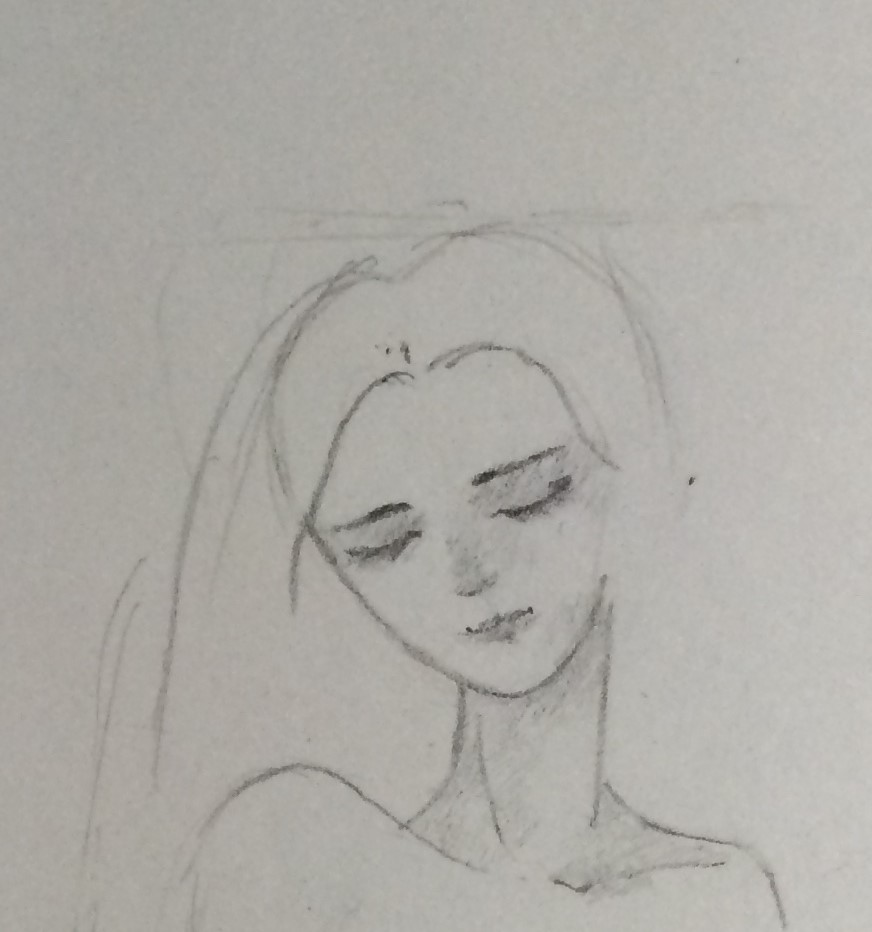

## Hello, from Xutong Ren

### About Me

Hello, I am Xutong Ren (任旭彤), undergraduate student of computer science at Peking University, Beijing, P.R.China. Now I am a research assistant at Institute of Computer Science and Technology, Peking University. My interesting is in computer vision and image processing. Rencently I have submitted a paper to ISCAS on image enhancement.

I love traditional art such as painting and designing interesting things. But I also like to introduce mordern science and technology to it, seeking for brand new interpretations. Eyes are both the entrance and exit of one's mind. Thus, it is a great pleasure to do research in domain of computer vision.

### Contact Me

Address: #30, Peking University, 5 Yiheyuan Road, Beijing, P.R.China  
E-mail: tonghelen@pku.edu.cn
